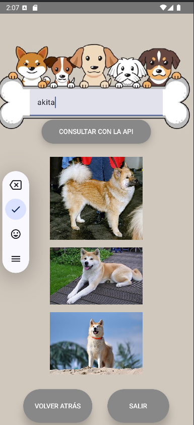

### Autor: Gelen Cueto.
# My Dog API Documentación

## Descripción de la aplicación

My Dog API es una aplicación Android diseñada para permitir a los usuarios registrarse, iniciar sesión y consultar imágenes de perros a través de una API gratuita. Los usuarios pueden buscar imágenes de perros según la raza y visualizar los resultados de manera visual y atractiva. La app incluye una notificación recurrente implementada con hilos (Handler) que recuerda a los usuarios que pueden consultar la API en cualquier momento. Además se utiliza una base de datos local donde los usuarios registrados se guardan usando Room para facilitar la gestión de datos de usuarios.

## Tecnologías utilizadas
- **Android Studio** - Entorno de desarrollo.
- **Jetpack Compose** - Para la interfaz de usuario.
- **Room** - Para la gestión de base de datos local.
- **Retrofit** - Para la integración con la API.
- **Handler** - Para la implementación de notificaciones recurrentes.

## Pantallas
### Pantalla de Inicio
Se muestra una pantalla de bienvenida con una imagen de fondo y un botón para navegar a la pantalla de inicio de sesión.
Si el usuario presiona el botón de retroceso, se cierra la aplicación.

### Pantalla de Iniciar Sesión
El usuario ingresa su nombre de usuario y correo electrónico.
El correo es validado para verificar su sintaxis.
Si el correo o el usuario no existen en la base de datos, muestra un mensaje de error.
Si el usuario y el correo son correctos, el sistema lo redirige a la pantalla de consulta, donde se obtiene información de una API de perros.

### Pantalla de Registro
Permite a un nuevo usuario registrarse con un nombre de usuario y correo electrónico.
Verifica que el correo no esté en uso y que su formato sea válido.
Si todo es correcto, el usuario se registra en la base de datos y se le lleva de vuelta a la pantalla de inicio de sesión.

### Pantalla de Consulta
Aquí, los usuarios pueden buscar imágenes de perros por raza.
Cuando se introduce una raza en un campo de texto y se presiona un botón, la app hace una solicitud a la API de perros (https://dog.ceo/api/breed/) y obtiene imágenes correspondientes a esa raza.
Las imágenes se muestran en una lista vertical (LazyColumn).
La app también sigue mostrando un mensaje periódico mediante el Handler para recordar que la API puede ser consultada.

## Pasos para ejecutar el proyecto

### Prerequisitos:
- **Android Studio: Se recomienda tener instalado Android Studio para compilar y ejecutar el proyecto en un entorno de desarrollo adecuado.**

- **Emulador o dispositivo físico: Asegurarse de tener un dispositivo Android configurado o un emulador funcionando para probar la aplicación.**

### Instrucciones para ejecutar el proyecto:
1. **Clonar el repositorio:**

       -git clone https://github.com/tu-usuario/my-dog-api.git

2. **Abrir el proyecto en Android Studio:**

       -Abrir Android Studio y seleccionar Open an existing project.
    
       -Navegar hasta la carpeta donde se ha clonado el repositorio y seleccionar el proyecto.
3. **Configurar dependencias:**

       -Asegurarse de tener una conexión a internet para que Android Studio pueda descargar todas las dependencias necesarias (como Retrofit, Room, y las bibliotecas de Jetpack).
 
4. **Compilar y ejecutar la aplicación:**

       -Hacer clic en el botón Run en Android Studio o usar el atajo Shift + F10.

       -Seleccionar un dispositivo físico o un emulador para ejecutar la aplicación.

Siguiendo estos pasos se puede comenzar a utilizar la aplicación.

## Decisiones tomadas durante el desarrollo

### Uso de una API gratuita (Dog API):
Decidí elegir la Dog API debido a que es una API gratuita, lo que me permitió integrarla fácilmente sin depender de servicios de pago. En segundo lugar, la API proporciona datos visuales (imágenes de perros), lo que hizo que la aplicación fuera más atractiva y mejora la experiencia visual de la app. Además, la Dog API tiene una estructura sencilla, lo que facilitó su integración con Retrofit para la gestión de peticiones HTTP

### Uso de Room para la base de datos local:
Para gestionar los usuarios registrados en la aplicación, decidí implementar Room, una solución local de base de datos para Android. Esto permitió almacenar de manera persistente los datos de los usuarios, como su nombre de usuario, correo electrónico y, lo más importante para este caso, el número de veces que un usuario ha iniciado sesión y la fecha de su último ingreso.

Cada vez que un usuario inicia sesión, el número de inicios se actualiza automáticamente en la base de datos, lo que proporciona un seguimiento útil del comportamiento del usuario. Además, la fecha del último ingreso se guarda como un campo de tipo LocalDateTime, lo que permite saber cuándo fue la última vez que un usuario interactuó con la aplicación.

### Conversión de datos con Room:
Al utilizar Room para la base de datos, decidí crear un converter para manejar tipos de datos que no son compatibles directamente con Room, como LocalDateTime (que se utiliza para registrar el último inicio de sesión del usuario). Este tipo de datos no puede almacenarse de forma predeterminada en una base de datos SQLite, por lo que implementé un converter para convertirlo a un formato compatible, como una cadena de texto.

### Validación del correo electrónico:
Decidí realizar las validaciones del correo electrónico manualmente, restringiendo la entrada a ciertos dominios de correo populares (Gmail, Hotmail, Yahoo, Outlook) para mantener la aplicación simple y evitar el uso de correos no deseados. Este enfoque también me permitió enfocarme en los requisitos del proyecto y simplificar la lógica de validación. Sin embargo, dejé abierta la posibilidad de ampliar esta lista de dominios si fuera necesario.

## Resumen de las búsquedas realizadas para implementar cada funcionalidad

Durante el desarrollo de la aplicación, realicé diversas búsquedas y consultas para implementar las funcionalidades clave. El material proporcionado por la profesora incluyó ejemplos de aplicaciones sencillas que implementaban tecnologías como Room, Jetpack Compose, Retrofit y el uso de Handlers para gestionar hilos. Estos ejemplos me dieron una base sólida y me orientaron en la correcta implementación de la base de datos, la interfaz de usuario moderna con Compose y la integración con una API externa.

Para profundizar en temas específicos, consulté documentación oficial de Android, tutoriales en línea y algunos recursos en YouTube. En particular, busqué ejemplos prácticos sobre cómo integrar Retrofit para la comunicación con una API externa, y encontré un blog en línea que detallaba cómo configurar y realizar peticiones HTTP usando Retrofit para obtener datos estructurados en formato JSON (https://medium.com/@kevinhomorales/usa-retrofit-en-android-con-kotlin-f6144111fc0d). Además. Todo este material me permitió comprender cómo trabajar con estas herramientas y adoptarlas adecuadamente para cumplir con los requisitos de la aplicación de forma eficiente y estructurada

 

## Commits descriptivos

- **PrimerCommit:** Implementación inicial de la aplicación con Jetpack Compose, estableciendo el diseño básico de la interfaz de usuario. Además, se configuró la base de datos utilizando Room para gestionar los datos de los usuarios, sin profundizar aún en las validaciones o funcionalidades técnicas.

- **SegundoCommit(ImpParcial de handler):** Implementación parcial de la funcionalidad de notificación recurrente mediante Handler. En esta etapa, se implementó el ciclo del hilo, pero sin un control adecuado para detenerlo de forma eficiente.

- **TercerCommit(Conexión API):** Implementación completa de la funcionalidad del Handler con control adecuado de detención del hilo. Además, se integró la API de Dog para obtener imágenes de perros según la raza, sin enfocarse aún en el diseño o el ajuste adecuado de las imágenes.

- **UltimoCommit (DiseñoCompleto):** Versión final de la aplicación, mejorando los aspectos visuales, la estética general, y optimizando la navegación entre pantallas. Se realizaron ajustes en el diseño de la interfaz, asegurando una experiencia de usuario más fluida y atractiva.

## Organización del proyecto y buenas prácticas
La organización del proyecto está estructurada de la siguiente manera para facilitar la gestión del código:

### Database
Esta carpeta contiene todos los elementos relacionados con la gestión de la base de datos utilizando Room. Incluye:

    -AppDatabase: La clase que define la base de datos y sus entidades.

    -Converter: El convertidor para manejar tipos de datos no compatibles con Room, como la conversión de LocalDateTime a un tipo compatible con la base de datos.

    -Usuario: La entidad que representa a un usuario registrado en la base de datos.

    -UsuarioDAO: El acceso a los datos de los usuarios, que define las operaciones CRUD sobre la base de datos.

    -UsuarioRepository: La capa de abstracción que interactúa con UsuarioDAO para realizar operaciones sobre los datos de los usuarios.
### Retrofit
Esta carpeta contiene las clases relacionadas con la integración de la API de Dog mediante Retrofit. Incluye:

    -APIService: La interfaz que define las solicitudes HTTP a la API de Dog.

    -DogResponse: La clase de respuesta que mapea los datos de la API a un formato adecuado para la aplicación.

### MainActivity.kt

La actividad principal que maneja la interfaz de usuario, el ciclo de vida de la aplicación y la gestión de la base de datos. Aquí se integran todos los componentes de la aplicación, incluyendo la navegación y las funcionalidades asociadas.

Esta estructura sigue buenas prácticas de organización, separando claramente las responsabilidades de cada componente y facilitando el mantenimiento del código.

## Imagenes

